# Deploy de Aplicação Estática na AWS S3 🌐☁️

## 💡 Contexto

Nesse processo, eu trabalhei com uma aplicação **estática**, composta apenas por arquivos **HTML, CSS e JavaScript puro**, ou seja, sem frameworks ou build tools (como React ou Vue). O objetivo foi **publicar essa aplicação na nuvem** usando o **Amazon S3**, transformando o bucket em um **servidor web estático**.

---
# Configuração Via Terminal

## 📦 Criação da Conta AWS

Antes de tudo, precisei criar uma conta na AWS. Isso envolveu:

- Acesso ao site: [aws.amazon.com](https://aws.amazon.com/)
- Preenchimento dos dados pessoais e de contato
- **Cadastro de um cartão de crédito ou débito** (obrigatório, mesmo para o plano gratuito)
- Escolha do plano gratuito (Free Tier), que já inclui **5 GB de armazenamento S3**

Depois disso, a conta passou por uma verificação automática e foi ativada após alguns minutos.

---

## 🪣 Criação do Bucket S3

Com a conta criada e o AWS CLI configurado, criei um bucket para receber os arquivos do projeto.

Passos no console da AWS (via navegador):

1. Acesse o serviço **S3**
2. Clique em **"Create bucket"**
3. Defina um nome único global, como `kardappio-menu`
4. Região: selecionei `South America (São Paulo)` (`sa-east-1`)
5. Desmarquei a opção **"Block all public access"** (isso é necessário pra que os arquivos sejam acessíveis via navegador)
6. Ativei a opção de **Static website hosting** mais tarde nas propriedades

---

## 🛠️ Etapas do Deploy

### 1. **Clonei o repositório da aplicação**

```bash
git clone https://github.com/janpereira82/FullStack.git
cd FullStack/Kardappio
```

### 2. **Verifiquei que o projeto era estático**

A pasta `Kardappio` continha apenas arquivos `index.html`, `.css` e `.js`. Por isso, **não foi necessário nenhum build com npm**.

---

### 3. **Configurei o CLI da AWS**

Rodei no terminal:

```bash
aws configure
```

Preenchi com:
- Access Key ID
- Secret Access Key
- Região (`sa-east-1`)
- Output format: `json`

---

### 4. **Subi os arquivos para o S3**

Dentro da pasta do projeto:

```bash
aws s3 sync . s3://kardappio --delete
```

Esse comando sincroniza todos os arquivos da pasta atual com o bucket `kardappio`, deletando do bucket qualquer arquivo que não esteja mais localmente.

---

### 5. **Configurei o bucket como site**

No painel da AWS:
- Abri o bucket `kardappio`
- Aba **Properties**
- Ativei a opção **Static website hosting**
- Configurei:
  - `index.html` como documento principal
  - (opcional) `404.html` como documento de erro

---

### 6. **Acesso final**

A URL gerada pela AWS foi algo como:

```
http://kardappio.s3-website-sa-east-1.amazonaws.com
```

A partir disso, a aplicação ficou **100% online**, hospedada direto no S3, acessível de qualquer lugar.

---

# Configuração via Plataforma AWS

## Passo 1 - Acessar o Console da AWS

Uma vez logado no seu console da AWS, procure pelo serviço **S3**:

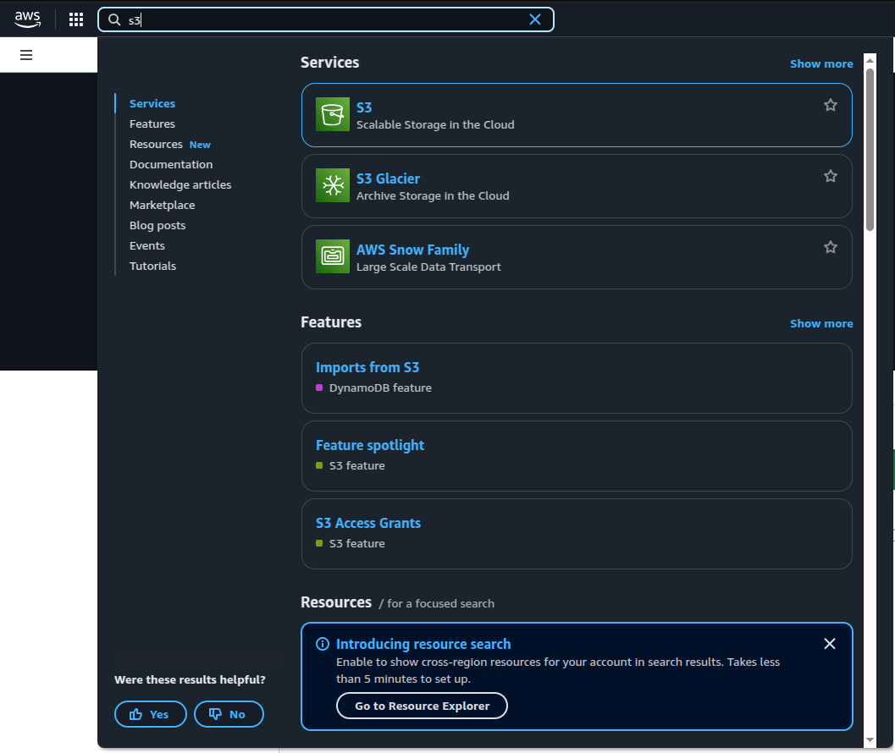

---

## Passo 2 – Introdução ou lista de buckets

Se for sua primeira vez usando o S3, será apresentada uma página de introdução. Caso contrário, você verá a lista dos seus buckets.

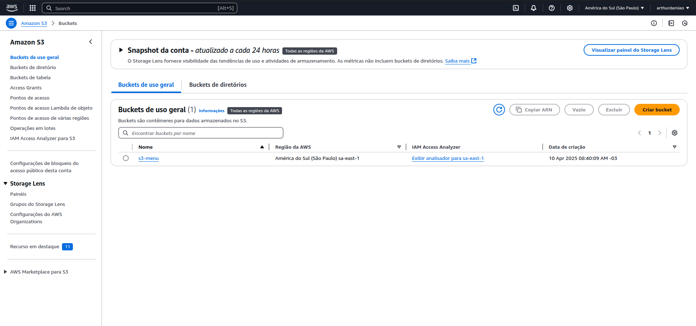

---

## Passo 3 – Criando um Bucket

No S3, os **buckets** funcionam como diretórios. Vamos criar um novo bucket clicando em **"Create Bucket"**.

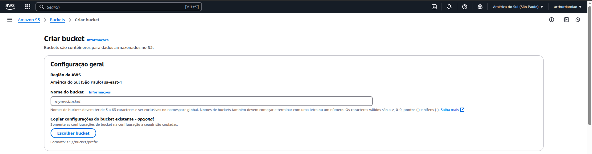

---

## Passo 4 – Configuração do Bucket

Escolha um nome único (em letras minúsculas, pode conter `.` e `-`), e depois desça até a seção **Public Access Settings**. Desmarque a opção de bloquear acessos públicos e aceite o aviso.

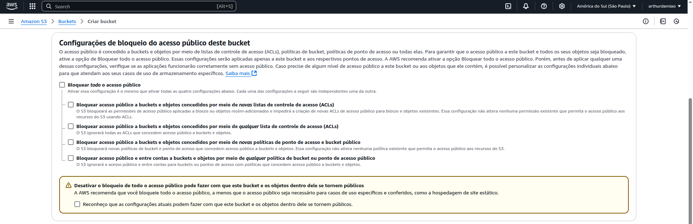

---

## Passo 5 – Finalizando a criação

Role até o final da página e clique em **"Create Bucket"**. Em seguida, clique no nome do bucket que você acabou de criar para acessá-lo.

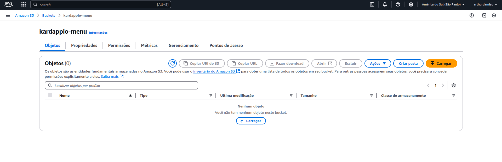

---

## Passo 6 – Fazendo Upload dos Arquivos

Clique no botão **Upload**, selecione os arquivos e pastas. Certifique-se de que seu `index.html` esteja na raiz do bucket.

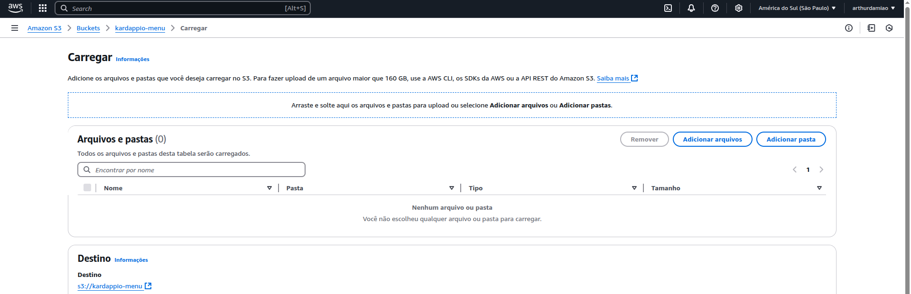

---

## Passo 7 – Configurar Permissões

Agora vamos permitir acesso público aos arquivos. Vá até a aba **Permissions** do seu bucket.

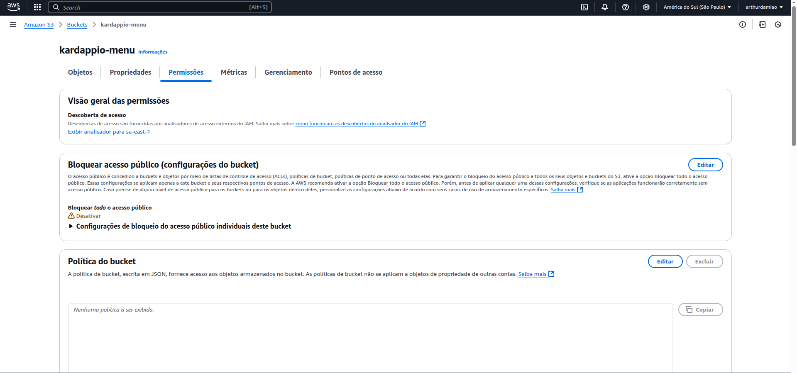

---

## Passo 8 – Editar Bucket Policy

Clique em **"Edit"** na caixa **Bucket Policy**.

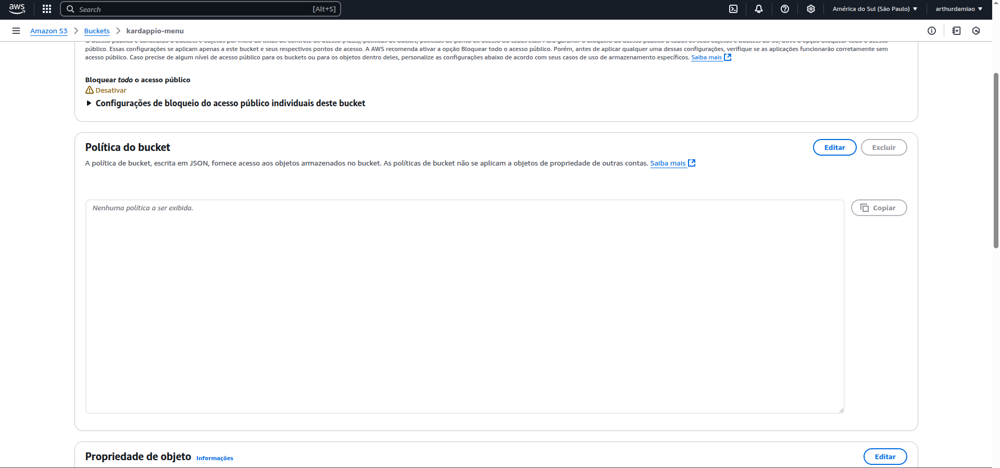  
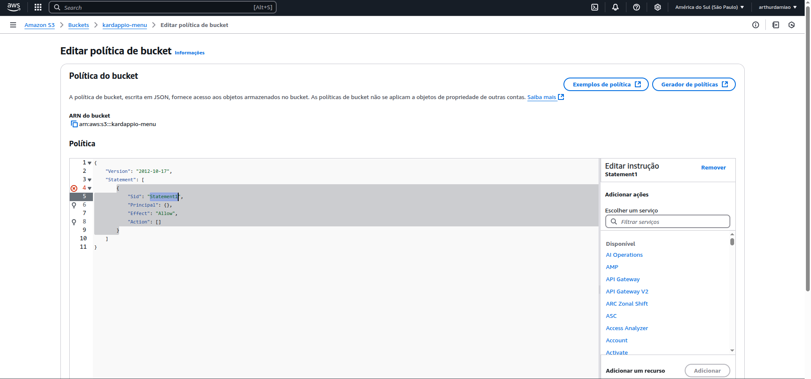

Substitua o conteúdo da policy atual pelo seguinte:

```json
{
    "Version": "2012-10-17",
    "Statement": [
        {
            "Sid": "PublicReadGetObject",
            "Effect": "Allow",
            "Principal": "*",
            "Action": [
                "s3:GetObject"
            ],
            "Resource": [
                "arn:aws:s3:::nomedoseubucket/*"
            ]
        }
    ]
}
```

> Lembre-se de substituir `"nomedoseubucket"` pelo nome real do seu bucket.

Clique em **"Save the Changes"**.

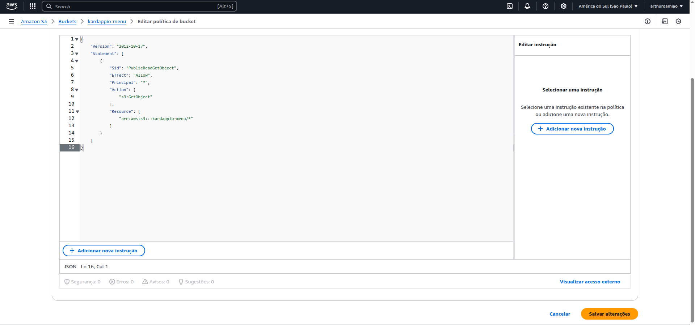

---

## Passo 9 – Ativar Static Website Hosting

Agora vá até a aba **Properties** do seu bucket.

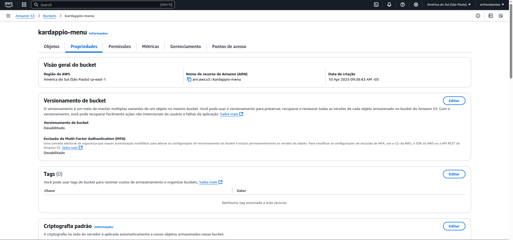

Desça até encontrar **Static Website Hosting** e clique em **Edit**.

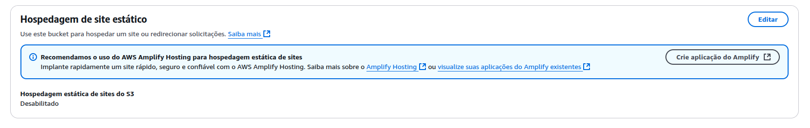

Configure a opção como a imagem abaixo:

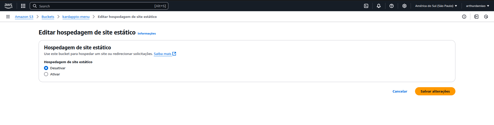  
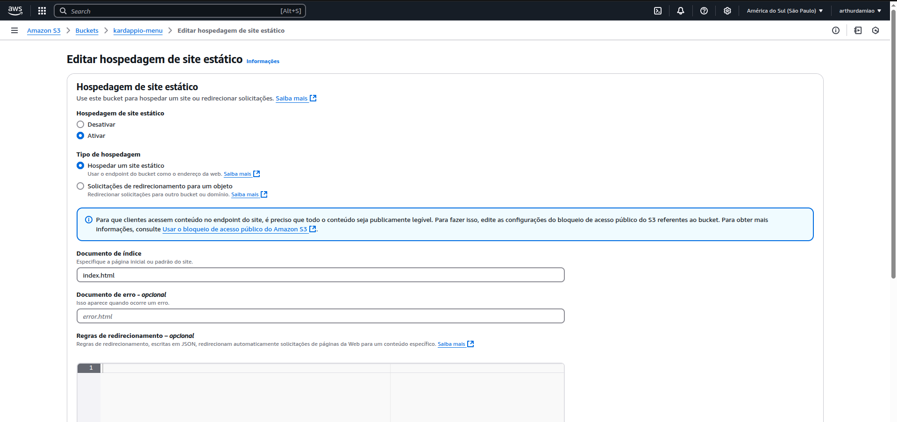

Ative a opção **"Enable"**, informe o nome do seu arquivo de index (ex: `index.html`) e clique em **"Save changes"**.

Você voltará à tela de propriedades, agora com a URL pública do seu site estático visível.

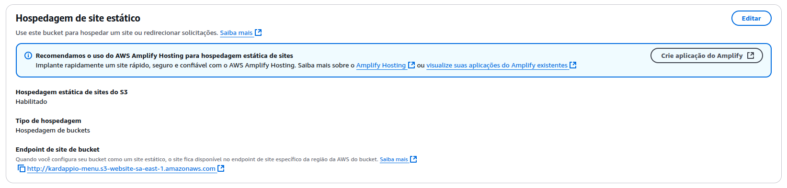

---

## 🎉 Pronto!

Seu site estático está **publicado no Amazon S3**! 🚀

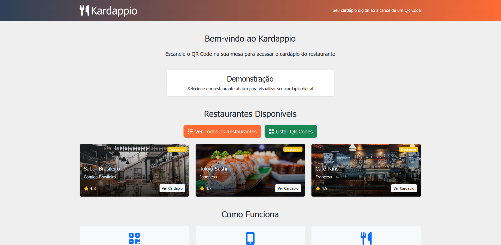

---

## ✅ Conclusão

Esse processo comprovou minha capacidade de:

- Criar e configurar buckets na AWS
- Lidar com permissões e configurações públicas de acesso
- Usar o AWS CLI pra sincronizar arquivos com o S3
- Trabalhar com deploy de aplicações estáticas
- Configurar **Static Website Hosting** corretamente

Esse tipo de operação é essencial pra qualquer dev que queira ter autonomia no deploy de aplicações web!
